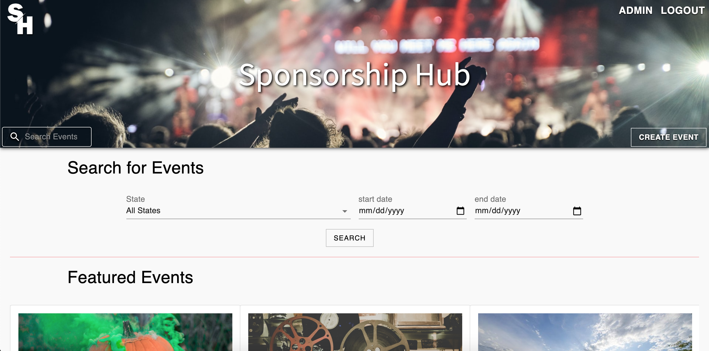
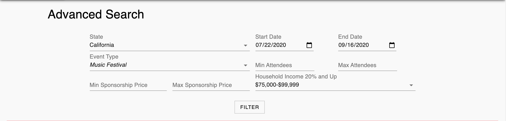
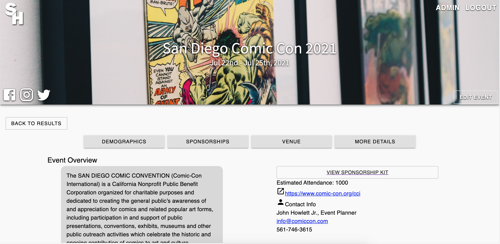
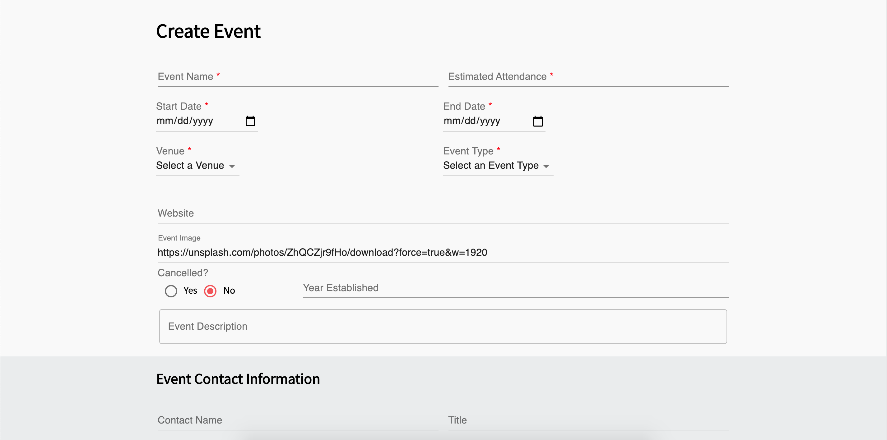
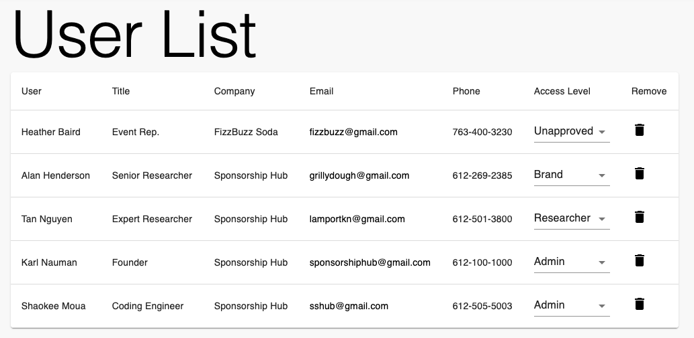

# Sponsorship Hub

## Description

Last Updated: July 9th, 2020

Duration: 2 Week Sprint

Sponsorship Hub is a web application that stores data from events such as festivals and gives brands interested in sponsoring those events the ability to search for the perfect fit using filters. Users may also create and edit events as desired with specific access that can be granted from the Admin. Sponsorship Hub stores collected data to reduce repetitive work for the researchers and connects brands with events quicker and easier.

To see the fully functional site, please visit: [http://sponsorshiphub.herokuapp.com](http://sponsorshiphub.herokuapp.com)

## Screenshots of Sponsorship Hub

Here are some screenshots of Sponsorship Hub

### **Landing Page**
This is the first page a user will see after logging in.  
It allows users to do a simple search and see featured events.



## **Advanced Search**
Allows users to perform customized search of all events.



## **Event Page View**
Displays all relevant information on the event.



## **Create Event**
Allows users with correct authorization to create a brand new event.



## **Admin User List**
Allows users with admin level access to change access levels and remove users.



## Prerequisites

Software required to install this application are as listed:

* [Node.js](https://nodejs.org/en/)

* [PostgreSQL](https://www.postgresql.org/)

* [Nodemon](https://nodemon.io/)

## Installation

1.) Create a database named ```sponsorship_hub``` and run the queries from our [database.sql](https://github.com/SponsorshipHub/sponsorship-hub/blob/master/database.sql)

2.) The queries inside of [database.sql](https://github.com/SponsorshipHub/sponsorship-hub/blob/master/database.sql) file are set to create the necessary tables to populate the needed data for this application to run correctly. This project is built on [Postgres](https://www.postgresql.org/), so you will need to make sure to have that installed. We recommend using [Postico](https://eggerapps.at/postico/) to run those queries as they were originally created there.

3.) Open your source code editor and run ```npm install```

3.) Create a .env file and set up SERVER_SESSION_SECRET=```superDuperSecretKey``` where ```superDuperSecretKey``` is your generated password. You can randomly generate a password here at [password generator](https://passwordsgenerator.net/).  If you don't do this step, create a secret with less than eight characters, you will get a warning. The secret value can be any random string of characters.

5.) To allow emails to be generated for the new user and the admin upon user registration, you will have to set up an API key for [Sendgrid](https://sendgrid.com/). Please set up an account with [Sendgrid](https://sendgrid.com/) and follow these [instructions](https://sendgrid.com/docs/ui/account-and-settings/api-keys/). Once you have created your API KEY, inside the .env file set up ```SENDGRID_API_KEY=yourSendgridApiKey```.

4.) Run ```npm run server``` in your terminal

5.) Run ```npm run client``` in your terminal which will open up a new browser with the application

## Usage

To use this application feel free to use the following steps

1.) Click ```LOGIN/REGISTER``` at the top right of the page to create an account. Upon account creation, the admin must approve the new user from the Admin User List page for access rights as ```Brand``` to search events or ```Researcher``` to create, edit, and duplicate events.

2.) With ```Brand``` access level, you can search events with from the landing page with the state, start and end date inputs then clicking ```Search```. You may then search with more advanced filters on the Results View page then clicking ```Filter```.

3.) With ```Researcher``` access level, you can create events with the ```Create Event``` at the bottom right of the Header. Here you can fill the form to create the event, then add sponsorship packages and demographics.

4.) As a ```Researcher``` one can also ```Edit``` events by clicking on events and clicking ```Edit Event``` at the bottom right of the header of an event page, then fill the form as needed. If you would like to ```delete``` or ```duplicate``` an event, at the bottom of the edit page.

5.) With ```Admin``` access level, you have the abilities of the ```Brand``` and ```Researcher```. You will also have an ```Admin``` button at the top right of the header. When clicked, you can grant access levels for your users and delete users.

6.) If you have registered but have yet to be approved by an ```Admin```, you will be unable to use a majority of the application and will be sent to a page that displays: "You are not authorized to view this page".


## Built with

* PostgreSQL

* Express.js

* React.js

* Node.js

* Redux.js

* Redux-Saga

* Axios

* Moment.js

* Sweetalert2

* Material-UI

* Recharts

* Passport

## Acknowledgment

Thanks to our instructors at Prime Digital Academy who helped equipped our group with the necessary skills and technologies to complete this application. Huge thanks to our client Karl Nauman for helping us bringing his vision of Sponsorship Hub to reality!

## Developers

If you have any suggestions or issues, please email our team. Here are a list of the original developers as well as their contact email.  Please include each user if possible.

Heather Baird | hrbaird10@gmail.com

Tan Nguyen | tannguyen1024@gmail.com

Alan Henderson | mr.alan.henderson@gmail.com

Shaokee Moua | m.shaokee@gmail.com